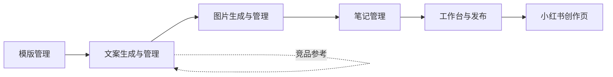

# 小红书运营台

面向 **小红书创作者平台** 的运营工作台：在本地完成标题、正文、配图与话题的组稿与预览，再通过 **Chrome 扩展** 将内容写入 `creator.xiaohongshu.com` 的图文发布页（或降级为打开创作页 + 剪贴板）。当前阶段聚焦 **「定稿 → 创作页可发」** 闭环；总览看板、文案生成、模版中心等见路线图，多为占位或后续迭代。

## 产品原型示意

以下为 **「工作台与发布」** 高保真原型：左侧为笔记选择、图稿编辑、标题/正文与发布栏；右侧为手机端 **笔记预览 / 封面预览**；顶部说明需配合 Chrome 扩展完成向创作页的写入。


*图源：`prototype/原型图片.png`，与 `prototype/prototype_v1.2.html` 等静态原型同源迭代。*

---

## 系统使用流程

**一句话：** 模版 + 竞品（可选）→ 生成文案版本 → 按版本生图入池 → 组合成草稿笔记 → 工作台载入、精修、辅助发布。



各模块围绕同一**内容条目**（会话内记住当前条目，各页自动沿用）：

| 步骤 | 做什么 | 运营台入口 |
|------|--------|------------|
| 0（可选） | 维护/启用模版，顶栏「选择模版」绑定到条目 | **模版管理** |
| 1 | 竞品分析（可选）→「重新生成」产生**文案版本**；可切换主版本、手改标题正文 | **文案生成与管理** |
| 2 | 选择**来源文案版本**，按文案 + 模版约束生图或上传，写入**图稿池** | **图片生成与管理** |
| 3 | 选文案版本 + 多选图稿（可选二级分类）→ **组合草稿** | **笔记管理** → 草稿 / 组合生成 |
| 4 | 从笔记管理载入草稿或继续编辑当前条目 → 预览 → **发布到小红书**（扩展填创作页，失败则剪贴板） | **工作台与发布** |

补充：**总览**为数据看板；**Google 生图**为可选入池路径。最终发布须在 `creator.xiaohongshu.com` **人工点击发布**。

---

## 项目背景

- **为什么要有运营台**：小红书创作页在浏览器内，与内部 CMS 不同源，无法直接由网页跨域操作 DOM。本仓库用 **自建运营台（Web）+ 数据库（PostgreSQL）** 管理草稿与图稿，用 **Chrome MV3 扩展** 作为「桥」：运营台通过 `chrome.runtime.sendMessage` 把标题、正文、图片 URL 等交给扩展，扩展在创作域内完成选 Tab、上传图、填表等动作。
- **当前能力边界**：扩展 **不会** 代替你在小红书点击最终「发布」；创作页改版会导致 DOM 选择器失效，需维护 `extensions/xhs-publish-bridge/src/content.ts`。生产环境需把真实运营台域名加入扩展 `manifest.json` 的 `externally_connectable.matches`。
- **文档与原型**：产品说明见 `prd/`（主流程以 `prd/prd_v1.2.html` §6 为准），交互原型见 `prototype/`，阶段计划见 `docs/plan-workbench-publish-first.md` 与 `docs/plan-code-development.md`。

---

## 仓库结构

| 路径 | 说明 |
|------|------|
| `apps/web` | React 19 + Vite 5 + TypeScript + Tailwind：工作台、预览、发布栏 |
| `apps/api` | FastAPI + SQLAlchemy + PostgreSQL：用户、条目、配图 CRUD、本地上传图静态服务 |
| `extensions/xhs-publish-bridge` | Chrome 扩展源码（`src/`）；**加载扩展请使用 `npm run build` 后的 `dist/`** |
| `docker-compose.yml` | 本地 PostgreSQL 16 |
| `prd/`、`prototype/`、`docs/`、`flowcharts/` | 产品与工程文档；主流程 Mermaid 见 `flowcharts/main-flow.mmd` |

根目录 `.gitignore` 已排除 `.env`、`node_modules`、各端 `dist/`、本地上传目录、`day01/`、`day02/` 等个人运营素材目录。

---

## 环境要求

- **Docker**（用于 PostgreSQL）
- **Node.js 20+**（推荐）、**npm**
- **Python 3.9+**（推荐 3.11+）
- **Google Chrome**（用于加载未打包扩展及外连运营台）

---

## 如何使用（本地联调）

### 1. 克隆与依赖

```bash
git clone <你的仓库 HTTPS 或 SSH 地址>
cd xiaohongshu   # 或你本地目录名
```

### 2. 数据库

在仓库根目录：

```bash
docker compose up -d
```

默认库名 `xiaohongshu`，用户/密码均为 `xhs`，端口 `5432`。连接串与 `apps/api` 默认配置一致。

### 3. API 服务

```bash
cd apps/api
python3 -m venv .venv
source .venv/bin/activate   # Windows: .venv\Scripts\activate
pip install -r requirements.txt
```

复制环境变量（与仓库根 `.env.example` 对齐即可）：

```bash
cp ../../.env.example .env
# 按需编辑 DATABASE_URL、API_BEARER_TOKEN、CORS_ORIGINS、UPLOAD_DIR、PUBLIC_BASE_URL 等
```

启动（开发建议带热重载）：

```bash
uvicorn app.main:app --reload --host 127.0.0.1 --port 8000
```

- 健康检查：<http://127.0.0.1:8000/health>  
- OpenAPI：<http://127.0.0.1:8000/docs>  
- 更多说明：`apps/api/README.md`

### 4. 前端运营台

```bash
cp apps/web/.env.example apps/web/.env
# 将 VITE_API_BEARER_TOKEN 与 API 的 API_BEARER_TOKEN 设为同一值
cd apps/web && npm install
```

在仓库根目录启动（推荐，与 `package.json` 脚本一致）：

```bash
npm run dev:web
```

浏览器访问 **<http://127.0.0.1:5173>**。Vite 已将 `/api` 代理到 `http://127.0.0.1:8000`，一般无需配置 `VITE_API_BASE_URL`。若 5173 被占用，可执行 `npm run dev:web:restart`。

### 5. Chrome 发布桥接扩展

```bash
cd extensions/xhs-publish-bridge
npm install
npm run build
```

在 Chrome 打开 `chrome://extensions` → 开启「开发者模式」→ **加载已解压的扩展程序** → 选择 **`extensions/xhs-publish-bridge/dist`**（不是 `src`）。

每次修改 `src/` 或根目录 `manifest.json` 后需重新执行 **`npm run build`**，再在扩展卡片上点「重新加载」。在运营台「Chrome 扩展 ID」处填入扩展详情页中的 ID，并可点「检测扩展连接」做 PING 校验。

### 6. 本地联调后的日常操作（步骤 4 细化）

完成上文 **§系统使用流程** 步骤 1～3 后，在 **工作台与发布**：

1. 在「从笔记管理选择」载入**组合草稿**，或直接编辑当前条目的主文案与图稿池。
2. 编辑 **标题**、**正文**；**话题** 每行或逗号分隔（无需写 `#`），保存后写入 API；发布时以 `#话题` 追加到正文末尾。
3. **配图**：URL 或本机上传（需 `PUBLIC_BASE_URL` 与扩展权限）；标星封面、勾选参与发布。
4. 勾选预览确认后 **「发布到小红书」**：扩展优先填创作页；失败则打开创作页并写入剪贴板。
5. 在 **creator.xiaohongshu.com** 核对后 **自行点击发布**。

---

## 生产与排障提示

- 生产运营台请使用 **HTTPS**，并把域名写入扩展 `externally_connectable`；图片建议使用 **HTTPS 公网地址** 或对象存储。
- 扩展版本、MutationObserver 与多图逻辑说明见 `extensions/xhs-publish-bridge/README.md`。
- 若创作页长期「加载中」，请升级到扩展 README 中建议的版本并重新加载扩展。

---

## 相关链接

- 远程仓库：<https://github.com/Pancakeze/xiaohongshu-ops>
