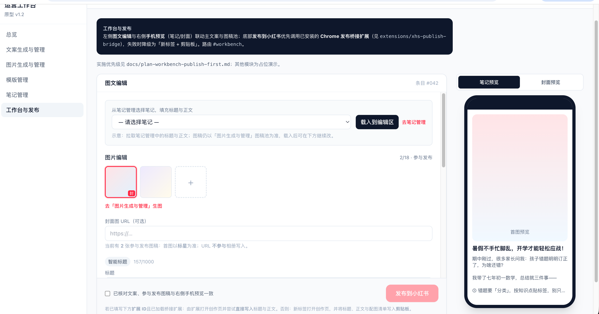
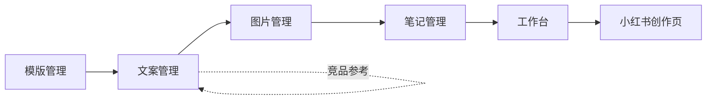

# 小红书运营台

面向 **小红书创作者平台** 的教育类内容运营工作台：在本地完成文案版本、图稿池、组合草稿与手机预览，再通过 **Chrome 扩展** 将标题、正文与配图写入 `creator.xiaohongshu.com` 图文发布页（失败时降级为打开创作页 + 剪贴板）。

扩展 **不会** 代替你在小红书点击最终「发布」；定稿与实际上线仍以官方创作页为准。

**远程仓库：** <https://github.com/Pancakeze/xiaohongshu-ops>

---

## 功能概览

| 模块 | 路由 | 能力摘要 |
|------|------|----------|
| 总览 | `/dash` | 已发布/本周/优质笔记指标、Top 笔记链接（数据看板） |
| 文案管理 | `/copy` | 竞品参考 + 模版生成、文案版本与主版本 |
| 图片管理 | `/images` | **图稿池**（分组、上传、参与发布、封面）+ **Google 生图**（聊天式，手动入池） |
| 模版管理 | `/templates` | 模版启用/停用，供文案生成引用 |
| 笔记管理 | `/notes` | 历史笔记同步、组合草稿（文案 + 多图快照） |
| 工作台 | `/workbench` | 载入组合草稿、图文编辑、手机预览、发布到小红书 |

会话内维护**当前内容条目**，各页自动沿用，无需重复选择条目。

---

## 产品原型

**工作台** 高保真示意：左侧图文编辑与发布栏，右侧手机 **笔记预览 / 封面预览**。



静态可交互原型：`prototype/prototype_v1.3.html` · 产品说明：`prd/prd_v1.3.html`（§6 主流程）

---

## 系统使用流程

**一句话：** 模版 + 竞品（可选）→ 文案版本 → 生图入池 → 组合草稿 → 工作台载入、精修、辅助发布。



| 步骤 | 做什么 | 入口 |
|------|--------|------|
| 0（可选） | 维护模版，顶栏「选择模版」绑定条目 | 模版管理 |
| 1 | 竞品分析（可选）→ 重新生成文案版本；设主版本、手改标题正文 | 文案管理 |
| 2 | 图稿池 Tab：上传/URL 入池；或 Google 生图 Tab：聊天生图后 **入池**（不自动绑定条目） | 图片管理 |
| 3 | 选文案版本 + 多选图稿 → **组合生成** 草稿（可选二级分类） | 笔记管理 |
| 4 | 工作台 **载入组合草稿**（仅展示草稿配图）→ 预览 → **发布到小红书** | 工作台 |

说明：

- `/google-images` 会重定向到 `/images?tab=google`。
- 组合草稿保存**不可变快照**；改图稿池不会自动回写旧草稿。
- 删除被快照引用的图稿时，服务端会先解除引用再删除（前端会二次确认）。

---

## 架构说明

```
运营台 (apps/web)  ──REST──▶  API (apps/api)  ──▶  PostgreSQL
       │
       └── chrome.runtime.sendMessage ──▶  xhs-publish-bridge (Chrome MV3)
                                              └── creator.xiaohongshu.com
```

- 运营台与创作页**不同源**，无法由网页直接操作小红书 DOM，故用扩展作桥。
- 扩展在创作域内：切「上传图文」、写入 `input[type=file]`、填写标题/正文；配图 URL 去重后最多 9 张，**单图**与多图均已适配。
- 创作页改版时需维护 `extensions/xhs-publish-bridge/src/content.ts`。
- 生产环境须将运营台 **HTTPS 域名** 写入扩展 `manifest.json` 的 `externally_connectable.matches`。

阶段计划：`docs/plan-workbench-publish-first.md`、`docs/plan-code-development.md`  
流程图源文件：`flowcharts/main-flow.mmd`

---

## 仓库结构

| 路径 | 说明 |
|------|------|
| `apps/web` | React 19 + Vite + TypeScript + Tailwind |
| `apps/api` | FastAPI + SQLAlchemy + PostgreSQL |
| `extensions/xhs-publish-bridge` | 发布桥接扩展（加载 **`dist/`**，非 `src`） |
| `docker-compose.yml` | 本地 PostgreSQL 16 |
| `prd/`、`prototype/`、`docs/`、`flowcharts/` | 产品与工程文档 |

`.gitignore` 已排除 `.env`、`node_modules`、各端 `dist/`、本地上传目录及 `day01/`、`day02/` 等个人素材目录。

---

## 环境要求

- Docker（PostgreSQL）
- Node.js 20+、npm
- Python 3.9+（推荐 3.11+）
- Google Chrome（扩展 + 运营台）

---

## 本地联调

### 1. 克隆

```bash
git clone https://github.com/Pancakeze/xiaohongshu-ops.git
cd xiaohongshu-ops
```

### 2. 数据库

```bash
docker compose up -d
```

默认库名 `xiaohongshu`，用户/密码 `xhs`，端口 `5432`。

### 3. API

```bash
cd apps/api
python3 -m venv .venv
source .venv/bin/activate
pip install -r requirements.txt
cp ../../.env.example .env
# 按需编辑 DATABASE_URL、API_BEARER_TOKEN、CORS_ORIGINS、UPLOAD_DIR、PUBLIC_BASE_URL
uvicorn app.main:app --reload --host 127.0.0.1 --port 8000
```

- 健康检查：<http://127.0.0.1:8000/health>
- OpenAPI：<http://127.0.0.1:8000/docs>
- 详见 `apps/api/README.md`

### 4. 前端

```bash
cp apps/web/.env.example apps/web/.env
# VITE_API_BEARER_TOKEN 与 API 的 API_BEARER_TOKEN 保持一致
cd apps/web && npm install
cd ../..
npm run dev:web
```

浏览器打开 <http://127.0.0.1:5173>。`/api` 已代理到 `8000`。端口占用时可执行 `npm run dev:web:restart`。

### 5. 发布扩展

```bash
cd extensions/xhs-publish-bridge
npm install
npm run build
```

Chrome → `chrome://extensions` → 开发者模式 → **加载已解压的扩展程序** → 选择 `extensions/xhs-publish-bridge/dist`。

修改扩展源码后须重新 `npm run build` 并点扩展卡片 **重新加载**。在工作台展开「发布助手」，填入扩展 ID 并 **检测发布助手**。

### 6. 发布前自检（工作台）

1. 在笔记管理完成 **组合生成**，于工作台下拉 **载入组合草稿**（或从笔记管理跳转自动载入）。
2. 核对标题、正文；话题每行或逗号分隔（无需 `#`），发布时自动追加到正文末尾。
3. 确认图片条与右侧手机预览一致（参与发布、封面标星）。
4. 勾选确认后点击 **发布到小红书**；在创作页核对后 **自行点击发布**。

配图建议：**HTTPS 公网 URL** 或配置 `PUBLIC_BASE_URL` 后的本地上传图，便于扩展拉取写入相册。

---

## 排障

| 现象 | 建议 |
|------|------|
| 扩展未接通 | 确认 ID、已加载 `dist/`、运营台与扩展同源策略；点「检测发布助手」 |
| 只发 1 张图失败 | 重新 build 并 **重新加载** 扩展（v1.3 已修复单图路径） |
| 创作页图越传越多 | 勿重复点发布；扩展已对同批 URL 只上传一次 |
| 删除图稿报 409 | 升级至当前 API：会先解除组合草稿快照引用 |
| 创作页长期空白/加载中 | 扩展 README；确认 URL 带 `target=image` |
| 发布助手报错来自小红书站点 | 多为创作页自身脚本，以扩展 PING/发布结果为准 |

更多扩展行为见 `extensions/xhs-publish-bridge/README.md`。

---

## 文档索引

| 文档 | 路径 |
|------|------|
| PRD v1.3 | `prd/prd_v1.3.html` |
| 交互原型 v1.3 | `prototype/prototype_v1.3.html` |
| 主流程图 | `flowcharts/main-flow.mmd` |
| 发布实施计划 | `docs/plan-workbench-publish-first.md` |
